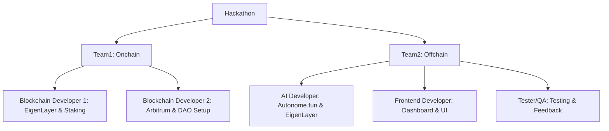
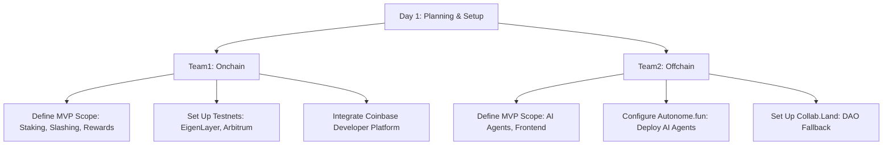
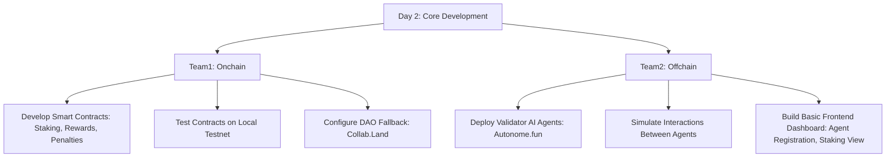
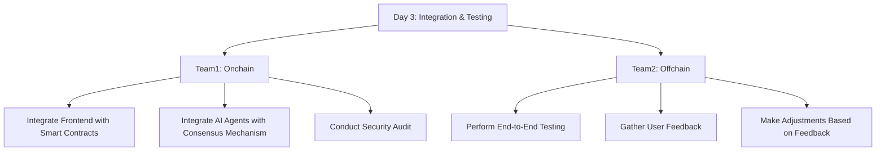
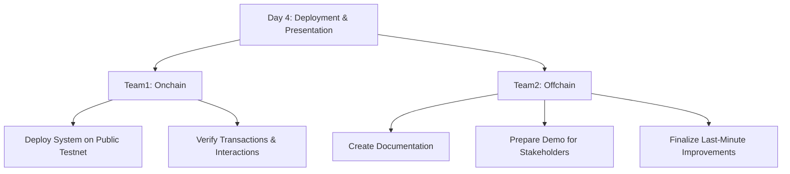
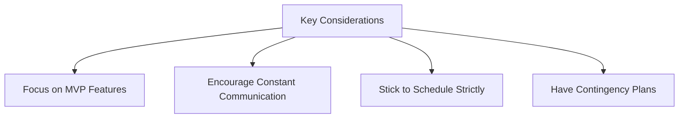

# Hackathon Team Structure and Workflow

## Team Structure

---

## Task Breakdown by Day

### Day 1: Planning & Setup

---

### Day 2: Core Development

---

### Day 3: Integration & Testing

---

### Day 4: Deployment & Presentation

---

## Key Considerations

