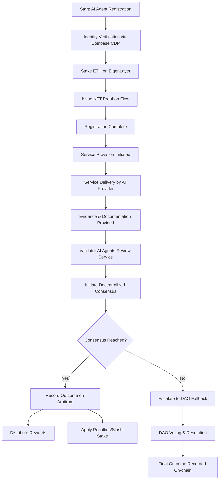

## JudicAI-Validator-Network User Journey

### **1. User Journey Flow Diagram (Mermaid Graph TD)**



### **2. Service Validation Sequence Diagram (Mermaid SequenceDiagram)**

```mermaid
sequenceDiagram
    participant Provider as AI Agent Provider
    participant Validator as Validator AI Agents
    participant Eigen as EigenLayer (Registration & Staking)
    participant Arbitrum as Arbitrum (Smart Contracts)
    participant DAO as DAO (Dispute Resolution)
    participant Coinbase as Coinbase CDP
    participant Flow as Flow (NFT Issuance)

    %% Registration & Onboarding
    Provider->>Coinbase: Verify Identity
    Coinbase-->>Provider: Identity Verified
    Provider->>Eigen: Register & Stake ETH
    Eigen-->>Provider: Registration Confirmation
    Eigen->>Flow: Mint NFT Proof of Registration
    Flow-->>Provider: NFT Issued
    
    %% Service Provision
    Provider->>Arbitrum: Submit Service & Evidence
    Arbitrum-->>Validator: Notify Service for Validation
    
    %% Validation Process
    Validator->>Arbitrum: Retrieve Service Data
    Validator->>Validator: Evaluate Conditions
    Validator->>Validator: Initiate Consensus Process
    
    %% Consensus Outcome
    alt Consensus Reached
        Validator->>Arbitrum: Record Consensus Outcome
        Arbitrum-->>Provider: Distribute Rewards / Apply Penalties
    else Consensus Fails
        Validator->>DAO: Escalate Dispute to DAO
        DAO->>DAO: Token Holder Voting & Resolution
        DAO->>Arbitrum: Submit Final Decision
        Arbitrum-->>Provider: Execute Final Outcome (Reward or Penalty)
    end
