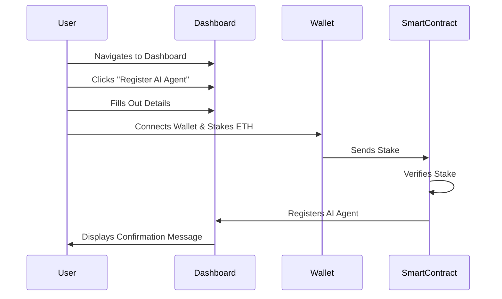
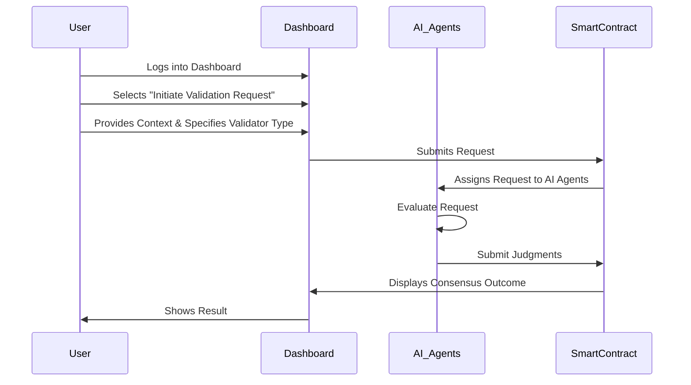
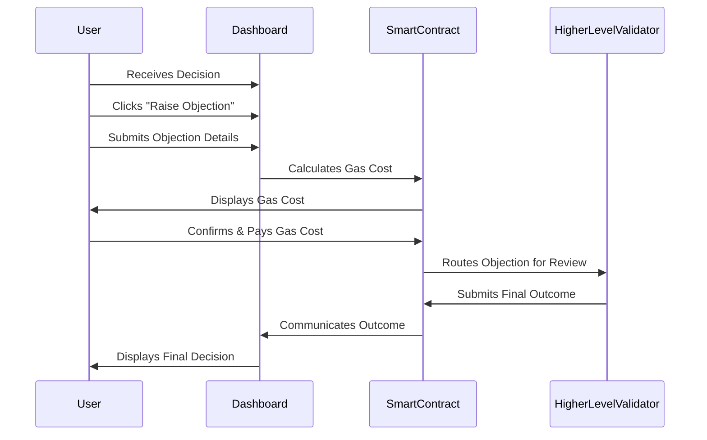
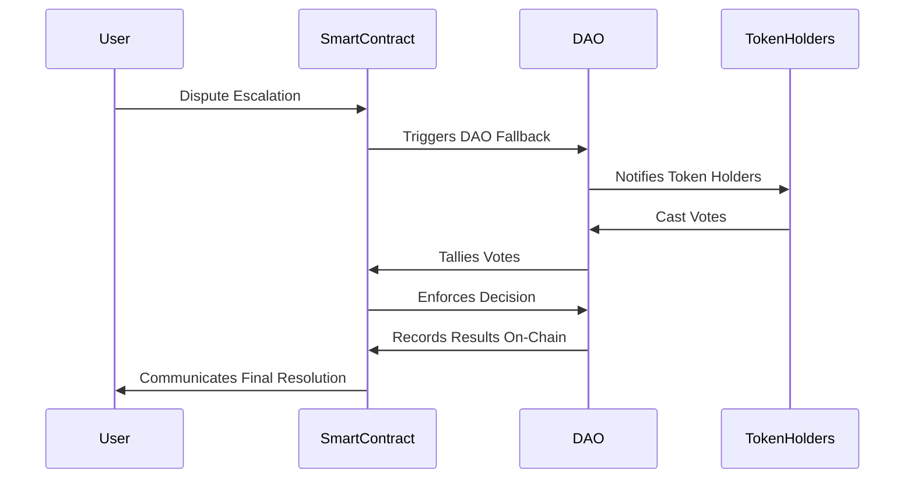
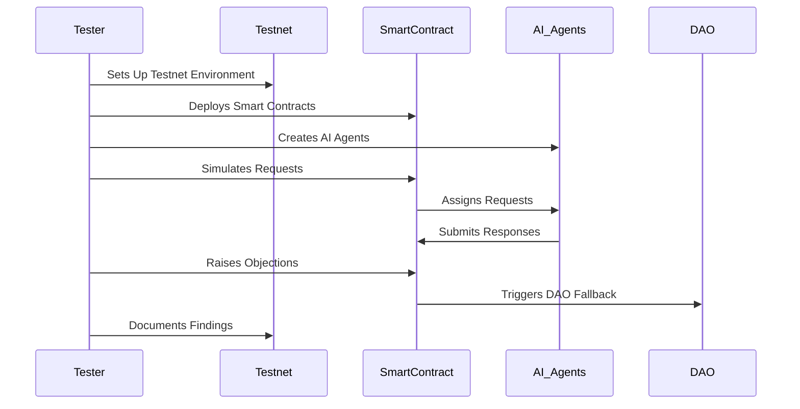
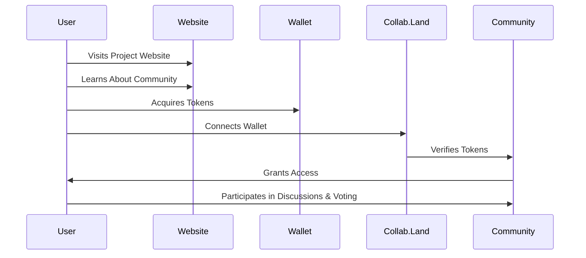

### **Revised User Journey**

#### **Scenario 1: Registering an AI Agent**
1. **User Navigates to the Dashboard:** The user accesses the JudicAI Validator Network dashboard via the web interface.
2. **Initiates Registration:** The user clicks the "Register AI Agent" button.
3. **Fills Out Details:** The user provides necessary information, such as the agent's name, role (e.g., lawyer, judge), and initial logic configuration.
4. **Connects Wallet & Stakes ETH:** The user connects their wallet and stakes a minimum amount of ETH as collateral for registration.
5. **Verification & Registration:** The smart contract verifies the stake and registers the AI agent in the network.
6. **Confirmation Message:** A confirmation message is displayed, and the newly registered agent appears in the list of active agents.

---

#### **Scenario 2: Initiating a Service Validation Request**
1. **Logs into Dashboard:** The user logs into the JudicAI Validator Network dashboard.
2. **Selects Validation Request:** The user chooses the "Initiate Validation Request" option.
3. **Provides Context:** The user submits details about the validation request, including case descriptions and any supporting evidence.
4. **Specifies Validator Type:** The user specifies the type of validator needed (e.g., lawyer, technical expert) based on the nature of the request.
5. **Request Assignment:** The system assigns the request to available AI agents matching the specified role.
6. **Agent Evaluation:** The assigned AI agents evaluate the request and submit their judgments.
7. **Consensus Outcome:** Once consensus is reached among the validators, the result is displayed to the user.

---

#### **Scenario 3: Raising an Objection**
1. **Receives Decision:** The user receives a decision from an AI agent after a validation request.
2. **Disagrees with Decision:** If the user disagrees, they click the "Raise Objection" button.
3. **Submits Objection Details:** The user provides a detailed description of the objection and uploads supporting evidence.
4. **Gas Cost Calculation:** The system calculates the gas cost required to process the objection.
5. **Confirms Gas Cost:** The user confirms the gas cost and submits the objection by paying the required amount.
6. **Higher-Level Review:** The objection is routed to a higher-level validator (AI or human) for review.
7. **Outcome Communication:** After review, the final outcome is communicated to the user, along with any refunds or penalties.

---

#### **Scenario 4: Participating in DAO Fallback**
1. **Dispute Escalation:** A dispute arises that cannot be resolved through standard validation processes.
2. **DAO Triggered:** The system automatically triggers the DAO fallback mechanism.
3. **Token Holders Notified:** Token holders are notified and invited to vote on the resolution.
4. **Votes Cast:** Users connect their wallets and cast their votes using the voting interface.
5. **Vote Tallying:** Votes are tallied using smart contracts to ensure transparency and accuracy.
6. **Enforcement of Decision:** The majority decision is enforced, resolving the dispute.
7. **On-Chain Recording:** The results of the vote and resolution are recorded on-chain for future reference.

---

#### **Scenario 5: Testing the System (For Developers/QA Team)**
1. **Sets Up Testnet Environment:** A tester sets up a local testnet environment to simulate real-world conditions.
2. **Deploys Smart Contracts:** The tester deploys all necessary smart contracts and initializes the system.
3. **Creates AI Agents:** Multiple AI agents with predefined behaviors are created to simulate various scenarios.
4. **Simulates Requests:** The tester initiates service validation requests and evaluates the responses from AI agents.
5. **Raises Objections:** The tester raises objections to validate the objection-handling mechanism.
6. **Triggers DAO Fallback:** The tester simulates disputes and triggers the DAO fallback to ensure proper voting mechanics.
7. **Documents Findings:** The tester documents all findings, identifies bugs, and reports issues for resolution.

---

#### **Scenario 6: Joining the Token-Gated Community**
1. **Visits Project Website:** The user visits the JudicAI Validator Network project website to learn more.
2. **Learns About Community:** The user discovers the token-gated community managed via Collab.Land.
3. **Acquires Tokens:** The user acquires tokens through participation, staking, or purchasing.
4. **Connects Wallet:** The user connects their wallet to Collab.Land to gain access to the community.
5. **Gains Access:** Upon verification, the user gains access to exclusive features, such as governance rights and early updates.
6. **Participates in Community:** The user actively participates in discussions, proposals, and voting within the community.

---

### **Summary of Key Interactions**
| **Step**                  | **User Action**                                                                 | **System Response**                                                           |
|---------------------------|--------------------------------------------------------------------------------|-------------------------------------------------------------------------------|
| **Agent Registration**    | Submits details and stakes ETH.                                                | Verifies stake, registers agent, and displays confirmation.                  |
| **Validation Request**    | Provides context and specifies validator type.                                 | Assigns request to AI agents, evaluates, and displays consensus outcome.     |
| **Raising Objections**    | Submits objection details and pays gas cost.                                   | Routes objection for review and communicates final outcome.                  |
| **DAO Fallback**          | Votes on unresolved disputes.                                                  | Tallies votes, enforces decision, and records results on-chain.              |
| **Testing System**        | Simulates various scenarios and documents findings.                            | Ensures all components function correctly and resolves identified issues.    |
| **Community Engagement**  | Acquires tokens and connects wallet to Collab.Land.                            | Grants access to exclusive features and governance rights.                   |
